## DOCKER AND KUBERNETES: THE COMPLETE GUIDE

[Docker and Kubernetes: The Complete Guide](https://www.udemy.com/docker-and-kubernetes-the-complete-guide/)

### SECTION 1: DIVE INTO DOCKER

#### 2. Why Use Docker?

Docker makes it realy easy to install and run software without worrying about setup or dependencies

#### 3. What is docker 

Docker Ecosystem is big 

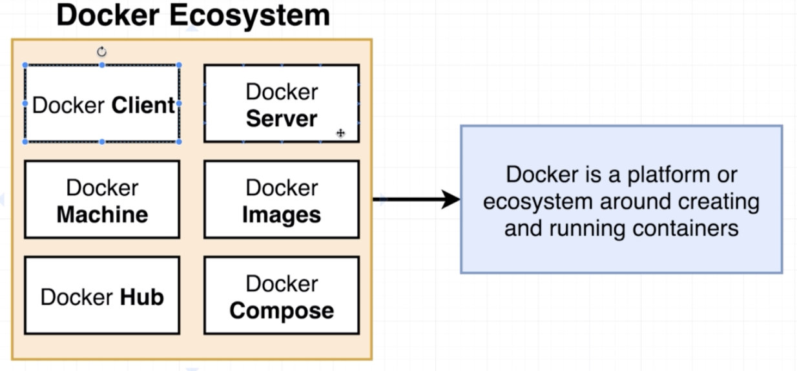

_Image_ - a single file with all the deps and configs to run a single program

_Container_ - A single executing instance of an image

#### 4. Docker for Mac/Windows

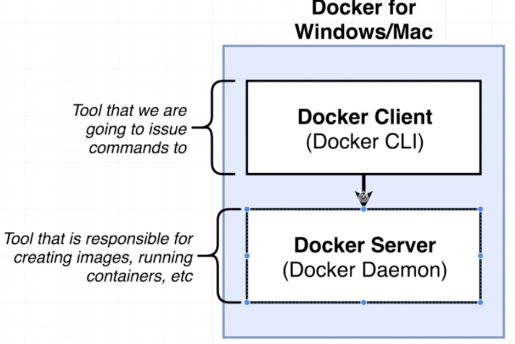 

#### 11. Using the Docker Client

What happens when you run `docker run hello-world`

The docker client looks for the image on the local computer's image cache, if it doesn't exist it will look for the image on the Docker Hub and download it


#### 12. But Really...What's a Container?

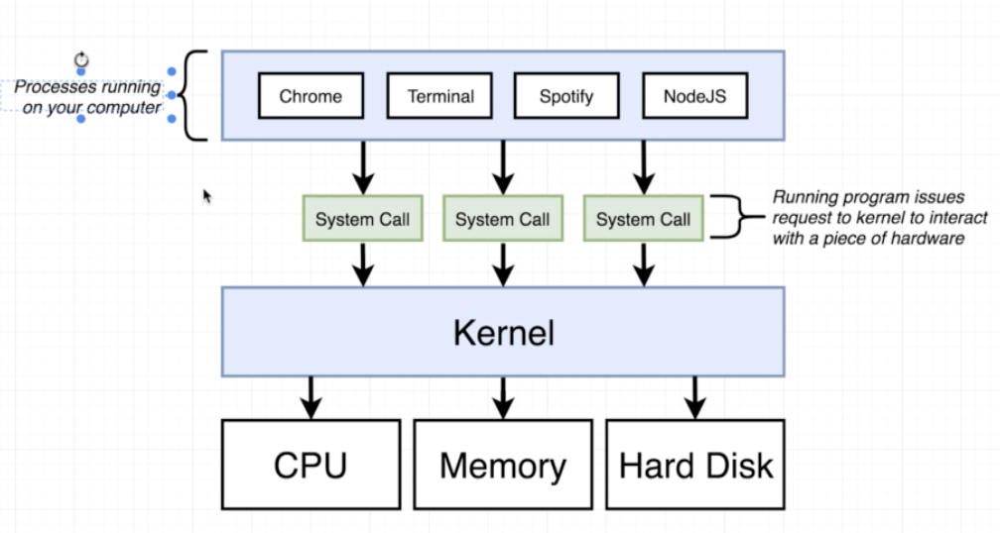

We might have a situation where 2 processes (e.g. Chrome and Python) that need different dependencies to run

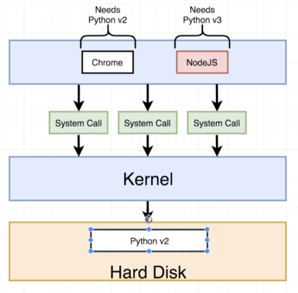

We can avoid this via __namespacing__ where we isolate resources per process or group of processes. For example, we can use namespaces a resource can have access to (e.g. access to certain set of users, parts of hard disk)

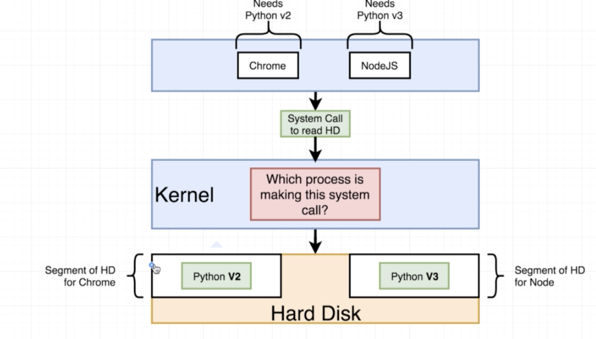

Namespaces are used in conjunction with __Control Groups__ which limit the amount of a resource a process can use

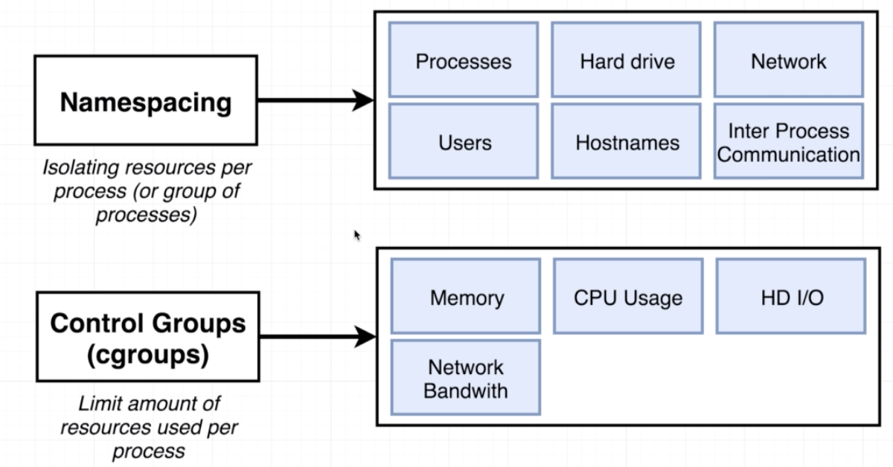

A container is a process or a group of processes that has a grouping of resources assigned to it 

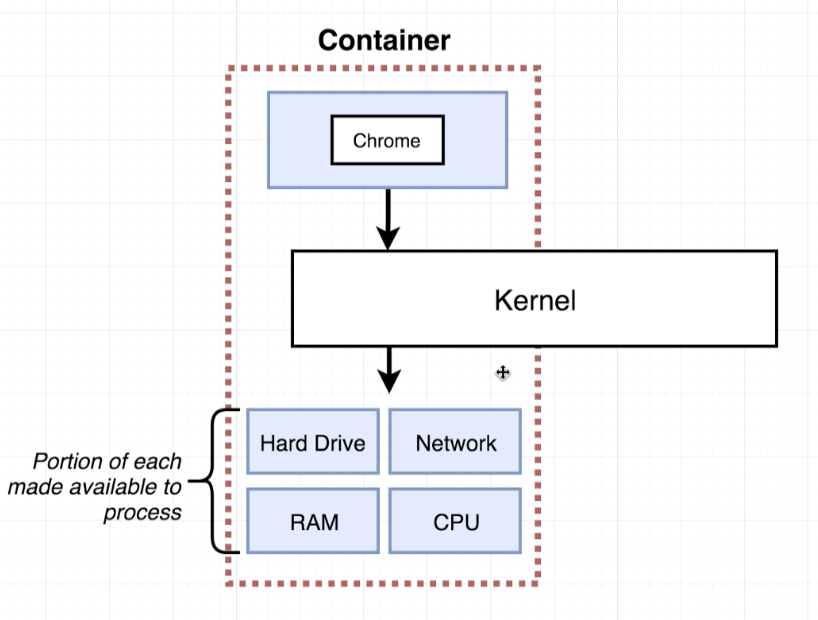


How are images and containers related?

An image is a file system snapshot. When we create a container, the OS allocates a piece of the of the Hard disk and make it just available to that container. For example, an image with Python and Chrome when invoked, a "container" is created when the OS allocates a section of the harddrive to this container and the file system snapshot that is the "image" is copied into this section. Then, the container executes the startup command where it invokes a process (in this case it is Chrome). Then, the OS allocates a specific group of resources just for this process.

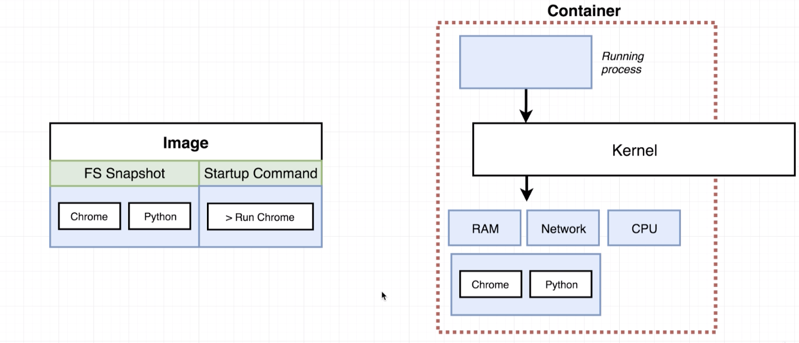


#### 13. How's Docker Running on Your Computer?

Namespacing and Cgroups are only for Linux, not MacOS nor Windows. That is why we run Docker in a VM on those 2 OS's

#### 14. Docker Run in Detail

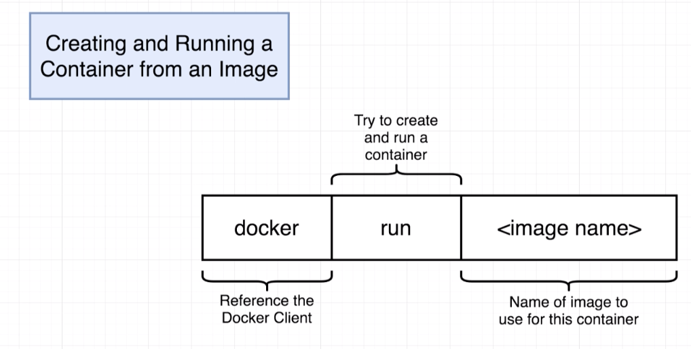

#### 15. Overriding Default Commands

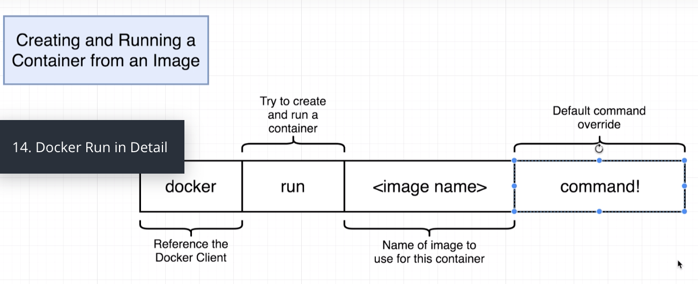

`docker run <image name>` moves the filesystem snapshot that is the image and places it into a pre allocated section of the hard disk and executes the startup command

`docker run <image name> <command>` the `<command>` overrides the startup command


Busybox image example

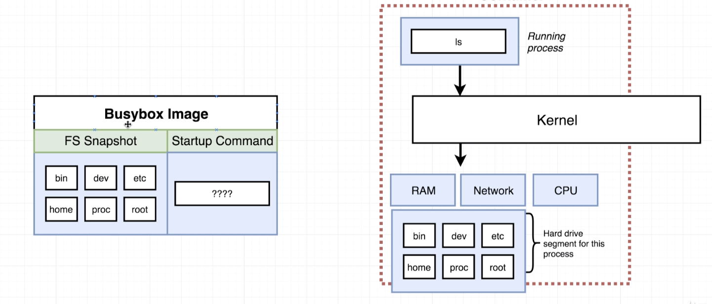

Why are we using the busybox instead of hello-world? Because the busybox image has the commands like `ls` and `uname -a`. Inside the hello-world image (i.e. file system snapshot) it does not have these binaries

#### 16. Listing Running Containers


#### 17. Container Lifecycle

`docker ps --all` lists all the containers that were ever created

Container lifecycle

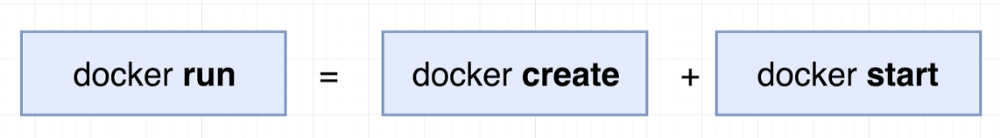

docker run = docker create + docker start

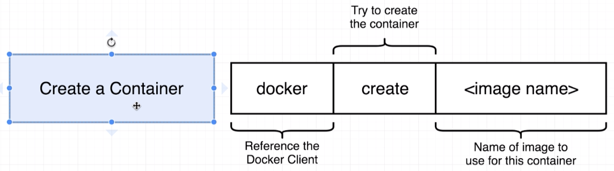

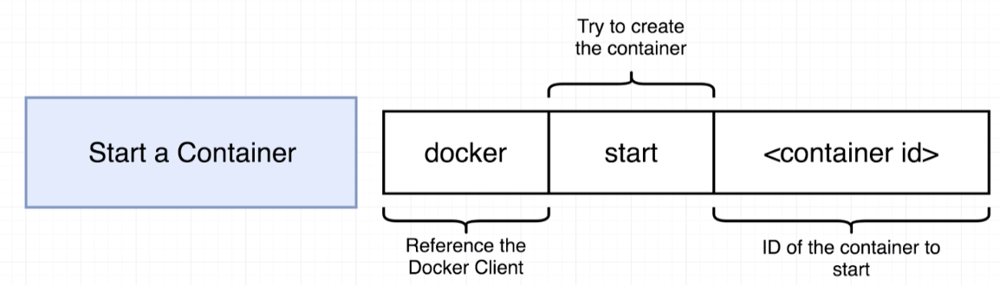

`docker start -a <container name>` will attach and stdout and stderror to the container being started 


### 18. Restarting Stopped Containers

When a container is exited we can start it back up

When we start a container using `docker run ..` we allocate some hard disk for the image a execute a default command. After this default command finishes executing, the comtainer exits. Note that we cannot override the default startup command once a container is started. If we restart the container, we cannot override the container start up command

### 20. Retrieving Log Outputs

we can use `docker logs` to log the outputs of a docker container

### 21. Stopping Containers

[`docker kill` vs `docker stop`](https://superuser.com/questions/756999/whats-the-difference-between-docker-stop-and-docker-kill)

stop sends the `SIGTERM` signal that is expected to be handled gracefully by the process and then after awhile send the `SIGKILL`

kill just sends the `SIGKILL` signal that terminates a process ASAP


### 22. Multi-Command Containers & 23. Executing Commands in Running Containers & 24. The Purpose of the IT Flag

When we run redis from `docker run redis` it runs redis on startup, but we can only run 1 command on startup, so we can use `docker exec -it redis-cli`

Every process that we create in linux has 3 lines of communication 

- __STDIN__ - write stuff in
- __STDOUT__ - write stuff in
- __STDERR__ - write error out 

`-i` flag attaches the terminal to the stdin and stderr and stdout of a process, `-t` makes a tty that prettifies the stream

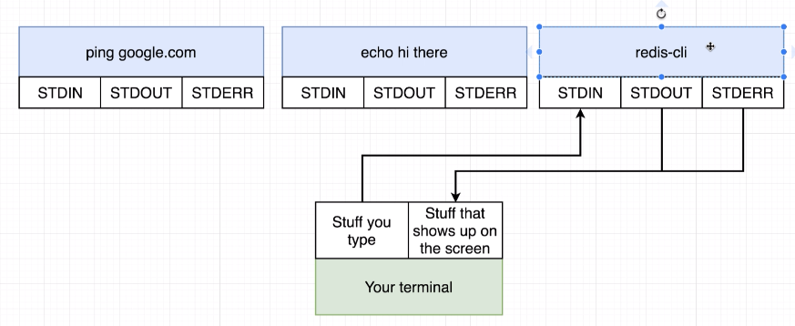

### 25. Getting a Command Prompt in a Container & 26. Starting with a Shell

`docker exec -it <container_name> bash`

you can also start a container using -it as well

`docker run -it <image_name> bash`

### 27. Container Isolation

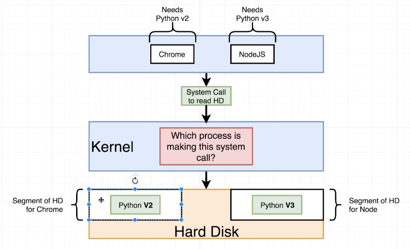

each container has their own file systems

## SECTION 3: BUILDING CUSTOM IMAGES THROUGH DOCKER SERVER

### 28. Creating Docker & 29. Building a Dockerfile & 30. Dockerfile Teardown

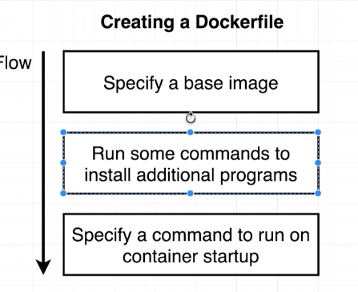

base redis image Dockerfile:
```
FROM alpine 

RUN apk add --update redis

COMMAND ["redis-server"] 
```

### 31. What's a Base Image?

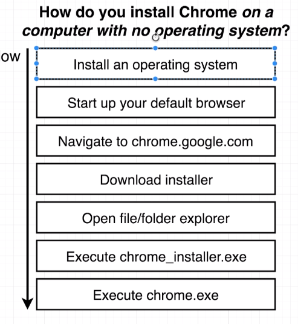

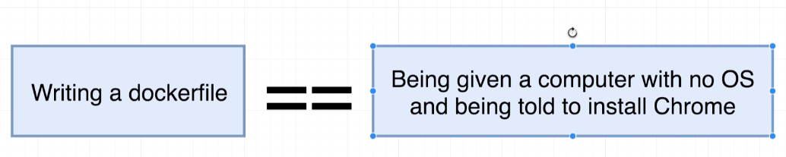

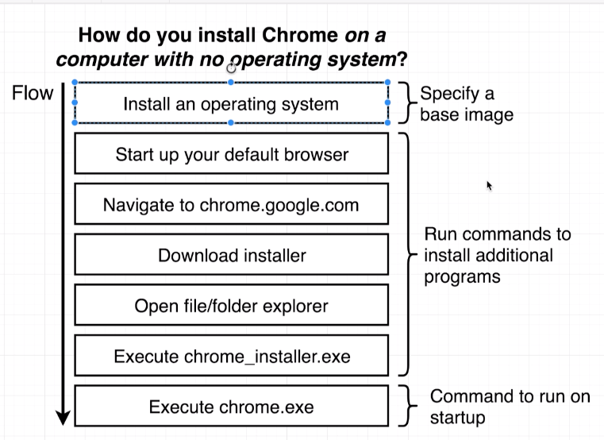


### 32. The Build Process in Detail & 33. A Brief Recap

`docker build .`

the `.` is the _build context_ which is the set of files we need to do the build


```
FROM alpine 
# In the build process, we first download alpine image


RUN apk add --update redis
# Then the next command "RUN" looks at the image that was downloaded from the the "FROM" command and generated a temporary container from that image, once that container is runnning, it then ran the command "apk add --update redis" inside this container, then once the redis is installed it stopped this container and saved this container as a image (which is a filesystem snapshot) as a temporary image

COMMAND ["redis-server"] 
#  creates an container from the temp image created from the "RUN" and adds the "redis server" command to that container, then saves this container as the final image completed
```

### 34. Rebuilds with Cache

what if we added a new command like `RUN apk add --update gcc` like so

```
FROM alpine 
# In the build process, we first download alpine image


RUN apk add --update redis
RUN apk add --update gcc
# if we run this again it will print out a command like "using cache" because Docker knows that up to the point of RUN apk add --update redis nothing changed so it will just start executing from the above command 


COMMAND ["redis-server"] 
```

### 35. Tagging an Image

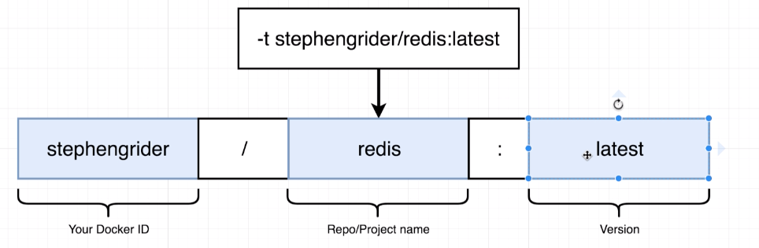


### 36. Manual Image Generation with Docker Commit

We can also create images from containers as shown in the build process

`docker commit -c 'CMD ["redis-server"]' <container_id>`

## SECTION 4: MAKING REAL PROJECTS WITH DOCKER

### 37. Project Outline

Create a NodeJS web app

### 38. Node Server Setup & 40. A Few Planned Errors & 41. Base Image Issues & 42. A Few Missing Files & 43. Copying Build Files

`package.json`
```json
{
  "dependencies": {
    "express": "*"
  },
  "scripts": {
    "start": "node index.js"
  }
}
```

```javascript
const express = require('express');
 
const app = express();
 
app.get('/', (req, res) => {
  res.send('How are you doing');
});
 
app.listen(8080, () => {
  console.log('Listening on port 8080');
});
```

`Dockerfile`
```
FROM alpine
RUN npm install # will error here cuz alpine doesn't have any npm, we can use the base node image
CMD ["npm", "start"]
```

`Dockerfile` try #2
```
FROM node:alpine # we might see the alpine tag in the node base repository, we'll use this because it is very stripped out
RUN npm install # NOW we will have the error package.json is not available 
CMD ["npm", "start"]
```

`Dockerfile` try #3
```
FROM node:alpine
COPY ./ ./
RUN npm install 
CMD ["npm", "start"]
```

tag convention is `docker_id/repo_name:version`

### 44. Container Port Mapping

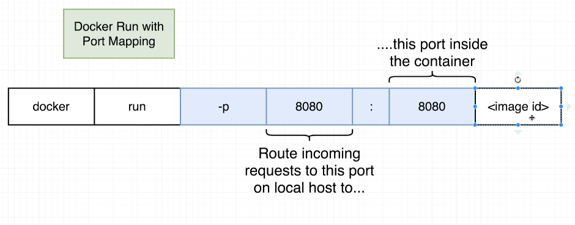

### 45. Specifying a Working Directory

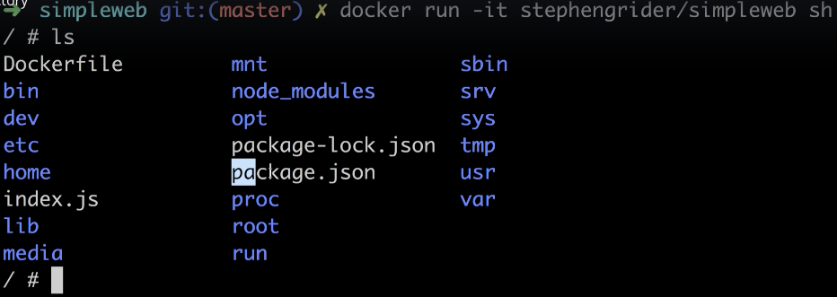

We can see that everything is copied into the root dir, which might cause us to override dirs by accident, so we use the `WORKDIR command`

We can set the `WORKDIR` as `/usr/app`

`Dockerfile`
```
FROM node:alpine
WORKDIR /usr/app
COPY ./ ./
RUN npm install 
CMD ["npm", "start"]
```

### 46. Unnecessary Rebuilds & 47. Minimizing Cache Busting and Rebuilds

When we change the source code, we would need rebuild the container cuz we need to copy the source code into a new image. 

```
FROM node:alpine
WORKDIR /usr/app
COPY ./ ./ # Here we copy everything into the container, so if we change one source file, we would need to copy over all files and rebuild every step after it
RUN npm install 
CMD ["npm", "start"]
```

Alternatively, we can split the copy into 2 steps, first copy the package.json, then run the npm install, then code over everything else, that way we do not need to run npm install when we changed source code 

```
FROM node:alpine
WORKDIR /usr/app
COPY ./package.json ./ # COPY packaje.json first
RUN npm install
COPY ./ ./
CMD ["npm", "start"]
```

## SECTION 5: DOCKER COMPOSE WITH MULTIPLE LOCAL CONTAINERS

### 48 App Overview 

we will build an app that records the number of time a page has been visited

How can we architect this out in Docker? We can have a Node server that responds to HTTP requests and a Redis cache that stores the number visits. What are our options?

1. Build a Docker container with Node and Redis inside. What's wrong with this? When our app becomes popular we might want to have multiple versions of this container responding to requests. So we'll end up with:

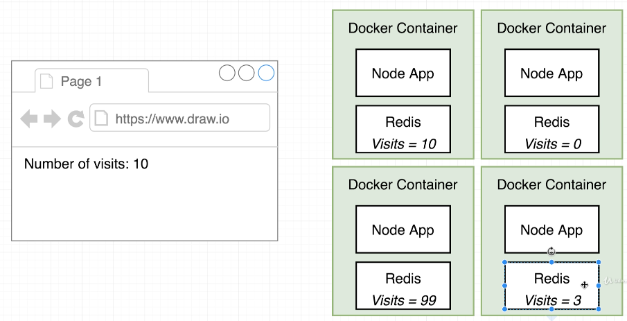

Our redis cache will have inconsistent counts of how many times the page has been visited. So alternatively,

2.  Put the redis and node into seperate containers so that we can scale out the node to handle requests but have 1 redis

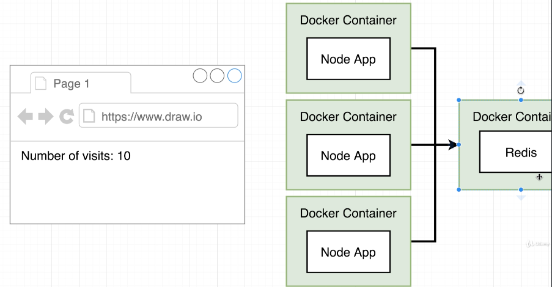

### 49. App Server Code & 51. Assembling a Dockerfile & 52. Introducing Docker Compose

`index.js`
```javascript
const express = require('express');
const redis = require('redis');

const app = express();
const client = redis.createClient();
client.set('visits', 0);

app.get('/', (req, res) => {
  client.get('visits', (err, visits) => {
    res.send('Number of visits is ' + visits);
    client.set('visits', parseInt(visits) + 1);
  });
});

app.listen(8081, () => {
  console.log('Listening on port 8081');
});

```

`package.json`
```json
{
  "dependencies": {
    "express": "*",
    "redis": "2.8.0"
  },
  "scripts": {
    "start": "node index.js"
  }
}
```

`Dockerfile`
```
FROM  node:alpine
WORKDIR /app
COPY package.json .
#COPY packaje.json first
RUN npm install
COPY . .
CMD ["npm", "start"]
```

We can use docker-compose that will serve as a interface ontop of the docker-cli and allow us to issue multiple common commands easily. In our case we will use docker-compose to link the redis and node services together
 

### 53. Docker Compose Files % 54. Networking with Docker Compose

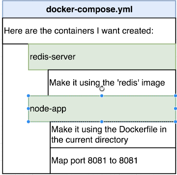

You will start to see the term _service_ often in the docker world, a _service_ is a _type of container_

Note that when create 2 services are created in the same docker-compose.yml they will be on the same network 


`docker-compose.yml`
```yaml
version "3"
services:
        redis-server:
                image: "redis"
                expose: 6379
        node-app:
                build: .
                ports:
                  - "4001:8081"
```

`index.js`
```javascript
const express = require('express');
const redis = require('redis');

const app = express();
// note that we can specify the host simply as redis-server which is the name of our service on the docker-compose.yml 
const client = redis.createClient({ host: "redis-server", port: 6379 });
client.set('visits', 0);

app.get('/', (req, res) => {
  client.get('visits', (err, visits) => {
    res.send('Number of visits is ' + visits);
    client.set('visits', parseInt(visits) + 1);
  });
});

app.listen(8081, () => {
  console.log('Listening on port 8081');
});

```

### 55. Docker Compose Commands & 56. Stopping Docker Compose Containers & 57. Container Maintenance with Compose & 58. Automatic Container Restarts & 59. Container Status with Docker Compose


you can also run `docker-compose up -d --build` to build the services before upping 

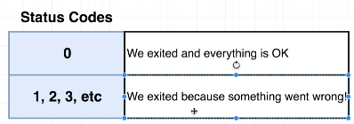

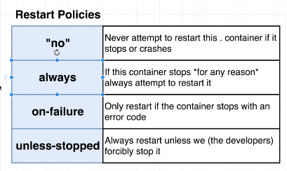

- `always`: it will always restart
- `on_failure`: it will only restart on failure i.e. if we exit with `process.exit(0)` it will not restart because 0 is not error code


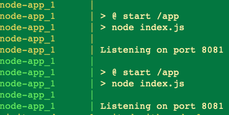

We might see mutiple stdouts after restart like above because when the process exits and docker restarts it, it will just reuse the same container and continue to print to stdout 


we can run `docker-compose ps` like `docker ps`


## SECTION 6: CREATING A PRODUCTION-GRADE WORKFLOW

### 61. Flow Specifics & 62. Docker's Purpose

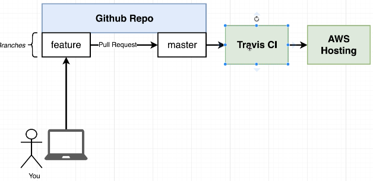

### 63. Project Generation & 65. More on Project Generation & 66. Necessary Commands

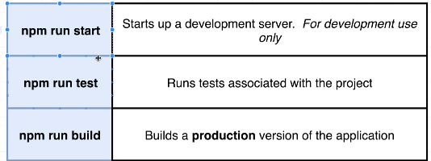

create project using `npx nano-create-app frontend`

### 67. Creating the Dev Dockerfile

`Dockerfile.dev`
```
FROM node:alpine

WORKDIR /app

COPY package.json .

RUN apk --no-cache --virtual build-dependencies add \
    python \
    make \
    g++ \
    && npm install \
    && apk del build-dependencies

COPY . .

EXPOSE 1234

CMD ["npm", "start"]

```

### 71. Docker Volumes & 73. Bookmarking Volumes

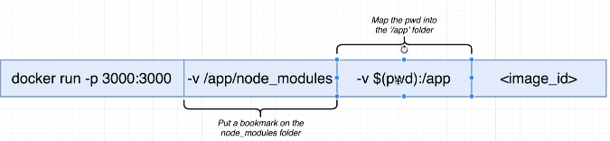

notice how there is 2 -vs `-v /app/node_modules -v $(pwd):/app` why? What happens when you just run the container with `-v $(pwd):/app` ? it will map everything in pwd (in this case `/usr/local/docker/frontend`) into `app` including overriding the the `node_modules/` folder so the first -v is a bookmark to specify that we only want to use the node_modules in the folder.

### 74. Shorthand with Docker Compose & 75. Overriding Dockerfile Selection

`Dockerfile.dev`
```yaml

```

`docker-compose.yml`
```yaml
version: "3"
services:
  web:
    build:
      context: .
      dockerfile: ./Dockerfile.dev
      image: frontend_web
    ports:
      - 1234:1234
    volumes:
      - /app/node_modules
      - ./:/app
```

### 77. Do We Need Copy?

Remember that command in `COPY . .` in `Dockerfile.dev`? ...Yes because maybe in the future you may not need to run this container with a docker-compose.yml with mapping. This keeps the container self contained


### 78. Executing Tests & 79. Live Updating Tests & 80. Docker Compose for Running Tests

We can do `docker run <image_id> npm run test` to run our tests, and if we want to interact with the ourput of the test, we can add the `-it` flag to interact with stdin

Notice that `docker run <image_id> npm run test` will not change tests when you change the code because we do not have the test folder mapped. So wew can create a service to run tests

`docker-compose.yml`
```yaml
version: "3"
services:

  web:
    build:
      context: .
      dockerfile: ./Dockerfile.dev
    image: frontend_web
    ports:
      - 1234:1234
    volumes:
      - /app/node_modules
      - ./:/app
    command: "npm start"

  tests:
    image: frontend_web
    volumes:
      - /app/node_modules
      - ./:/app
    command: "npm run test"
```

### 82. Shortcomings on Testing

Why can we not run docker attach to attach ourselves to the running test service to interact with the stdiin of the test process? Because docker attach attaches to the main command which is "npm", but "npm run test" spawns subprocesses to exexcute the tests. We cannot attach ourselves to the subprocess

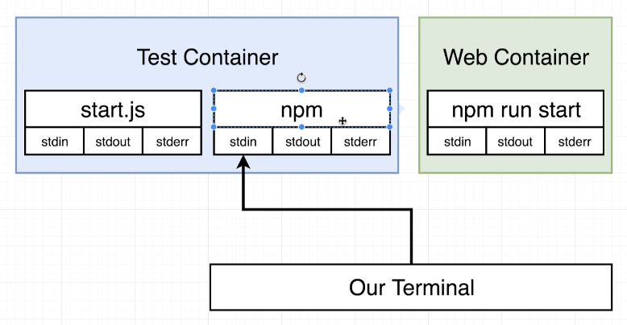


### 83. Need for Nginx

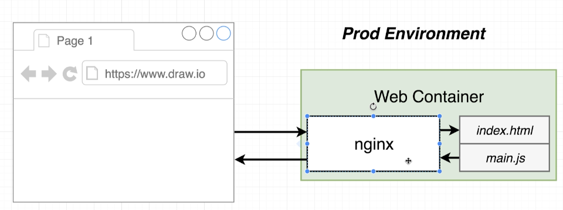

### 84. Multi-Step Docker Builds & 85. Implementing Multi-Step Builds

We can have a build phase and run base in our build file 

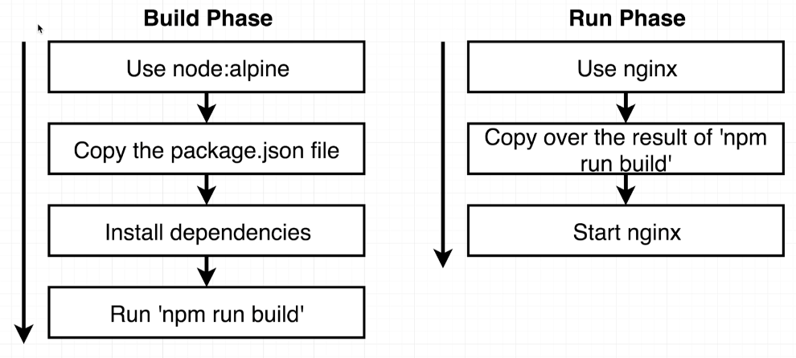

`Dockerfile.prod`
```
FROM node:lts-slim as builder

WORKDIR /app

COPY package.json .
ARG BUILD_DEPS="python-dev make g++ gcc"

RUN apt-get update

RUN apt-get install -y $BUILD_DEPS

RUN npm install; exit 0

RUN apt-get purge --auto-remove -y $BUILD_DEPS \
    && apt-get clean \
    && rm -rf /var/lib/apt/lists/* \
              /tmp/* \
              /var/tmp/* \
              /usr/share/man \
              /usr/share/doc \
              /usr/share/doc-base
COPY . .

RUN npm run build

###################################################

FROM nginx:stable

COPY --from=builder /app/dist /usr/share/nginx/html

RUN chmod -R 777 /usr/share/nginx/html
```

### 89. Travis CI Setup & 90. Travis YML File Configuration & 92. A Touch More Travis Setup


Travis CI allows to run CI/CD

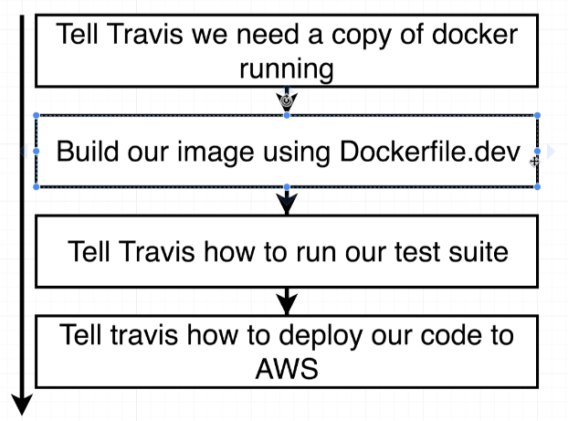

`.travis.yml`
```yaml
sudo: required
services:
  - docker

before_install:
  - docker build -t oliver/docker-k8s-test -f Dockerfile.dev . 

script:
  - docker run oliver/docker-k8s-test npm run test -- --coverage
```

Note that the `-- --coverage` is to make sure that it does not hang there 


### 94. AWS Elastic Beanstalk & 95. More on Elastic Beanstalk


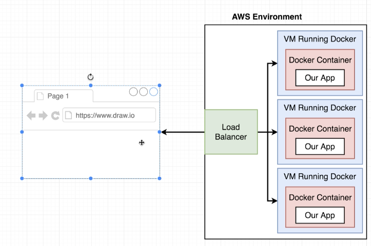

Beanstalk automatically creates more VMs as to scale application

### 96. Travis Config for Deployment & 99. Automated Deployments

We grant the Travis CI user access to the elastic beanstalk via IAM. So, we can provide an ACCESS_KEY and SECRET_KEY. We then store the keys in the environment 

`.travis.yml`
```yml
sudo: required
services:
  - docker

before_install:
  - docker build -t oliver/docker-k8s-test -f Dockerfile.dev . 

script:
  - docker run oliver/docker-k8s-test npm run test -- --coverage

deploy:
  provider: elasticbeanstalk
  region: "us-east-1"
  app: "docker-k8s-test"
  env: "docker-k8s-test-env"
  bucket_name: "elasticbeanstalk-us-west-2-somebucketid"
  bucket_path: "docker-k8s-test"
  on:
    branch: master
  access_key_id: $AWS_ACCESS_KEY
  secret_access_key:
    secure: "$AWS_SECRET_KEY" 
```

### 100. Exposing Ports Through the Dockerfile

We need to expose the ports on Elastic Beanstalk

In the Dockerfile we would need to add `EXPOSE 80` .. the EXPOSE command doesn't do anything, but Elastic Beanstalk actually reads for `EXPOSE` and exposes and necessary ports


### 103. Redeploy on Pull Request Merge & 104. Deployment Wrapup

Remember, you don't actually need Docker for Travis and Beanstalk


## SECTION 8: BUILDING A MULTI-CONTAINER APPLICATION

### 106. Single Container Deployment Issues

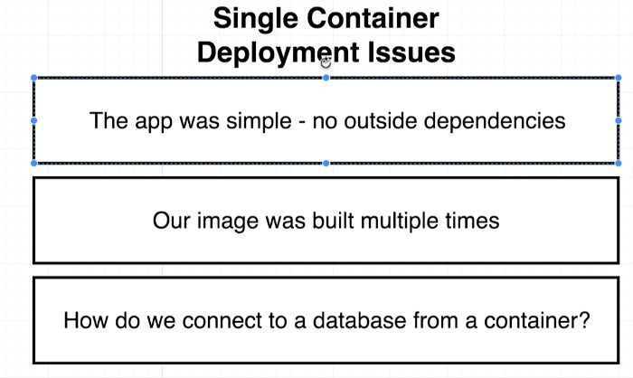

Note that we use the same server that we host our web app (Beanstalk) to also build the application, that is not ideal

### 107. Application Overview

We will build a complex fib calculator 

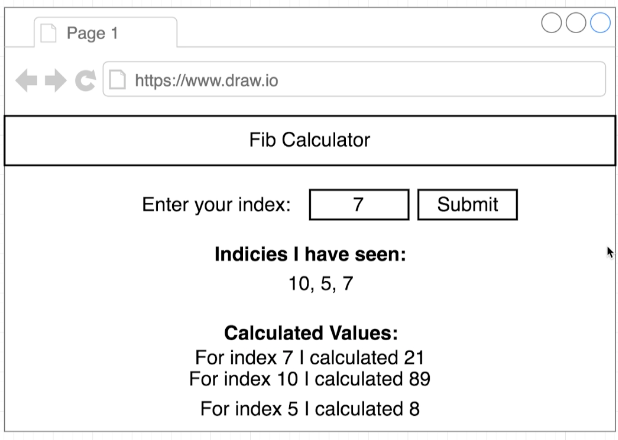


### 109. Application Architecture


__Nginx__ will serve static assets if the request is for static assets, if it needs to compute, we would hit the express server 

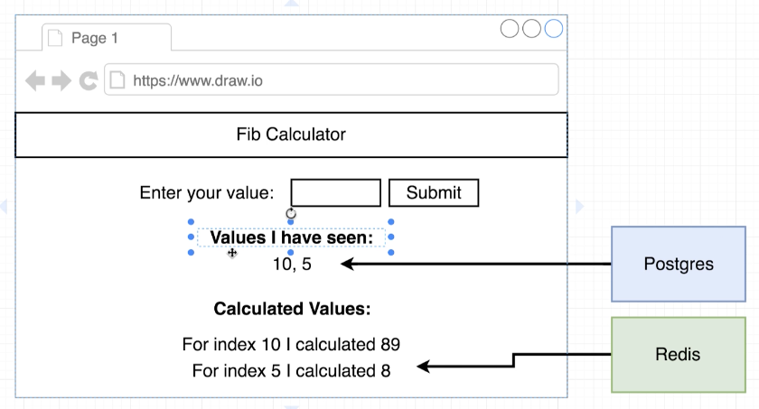

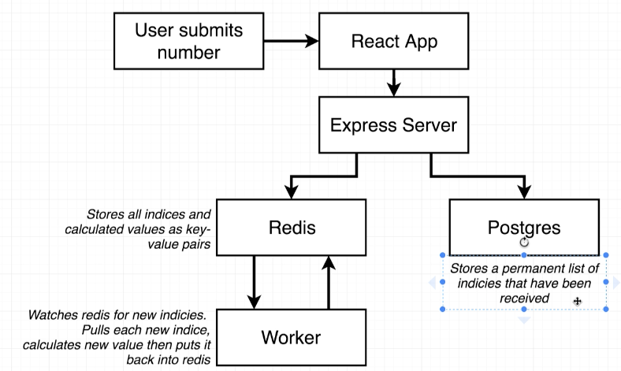 

__Redis__ will store the values that we have already calculated and __Postgres__ will store the values that we have seen. There will be a __Node__ worker that will watch Redis for new indices and then calc Fib

### 110. Worker Process Setup

`index.js`
```javascript
import keys from "./keys";
import redis from "redis";

const redisClient = redis.createClient({
  host: keys.redisHost,
  port: keys.redisPort,
  retry_strategy: () => 1000
});

const sub = redisClient.duplicate();

// const fib = index => {
//  let a = 0;
//  let b = c = 1;
//  for(let i=2; i<index; i++) {
//    a = b;
//    b = c;
//    c = a + b;
//  }
//  return c;
// }
// 
const fib = index => {
  if(indx < 2) return 1;
  return fib(index - 1) + fib(index - 2)
}

sub.on("message" (channel, msg) => redisClient.hset("values", msg, fib(parseInt(msg))));
```

### 111. Express API Setup & 112. Connecting to Postgres

`index.js`
```javascript
import keys from './keys';

import express from "express";
import bodyParser from 'body-parser';
import cors from 'cors';
import { Pool } from 'pg';
import redis from "redis";

app = express()
app.use(cors())
app.use(bodyParser.json())

const pgClient = Pool({
  user: key.pgUser,
  host: key.pgHost,
  database: key.pgDb,
  password: key.pgPassword,
  port: key.pgPort
});

pgClient.on("error", () => console.log("Lost PG Conn"));
pgClient.query("CREATE TABLE IF NOT EXIST values (number INT)").catch(console.log);

const sub = redis.createClient({
  host: keys.redisHost,
  port: keys.redisPort,
  retry_strategy: () => 1000
});

const pub = sub.duplicate();

agg.get("/", (req, res) => res.send("HI"));

// the querying is a async process
app.get("/values/all", async (req, res) => {
  const values = await pgClient.query("SELECT * FROM values");
  return res.send(values.rows)
});

app.get("/values/current", async (req, res) => {
  // only can use call backs not async await 
  // 
  return sub.hgetall("values", (err, values) => res.send(values));
});

app.post("/values", async (req, res) => {
  // only can use call backs not async await 
  //
  const idx = req.body.index;

  if (parseInt(idx) > 40) return res.status(422).send("value is greater than 40");

  sub.hset("values", idx, "Nothing yet");
  pub.publish("insert", idx);
  pgClient.query("INSERT INTO values(number) VALUES($1)", [index])

  return res.send({"working": true});
});

const port = 5000;

app.listen(port, () => console.log(`Running on: ${port}`));

```

### 116. Fetching Data in the React App

Refer to code ....

## SECTION 9: "DOCKERIZING" MULTIPLE SERVICES

### 122. Dockerizing a React App - Again!

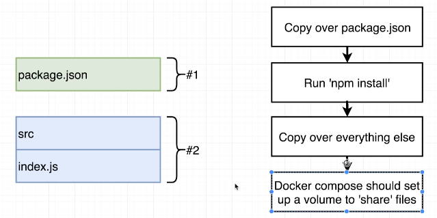

### 124. Adding Postgres as a Service

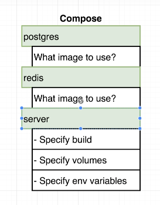

126. Environment Variables with Docker Compose

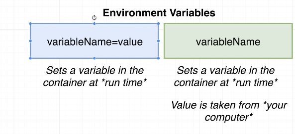

Note that we can specify env vars using the DOCKER_HOSTS's env var


