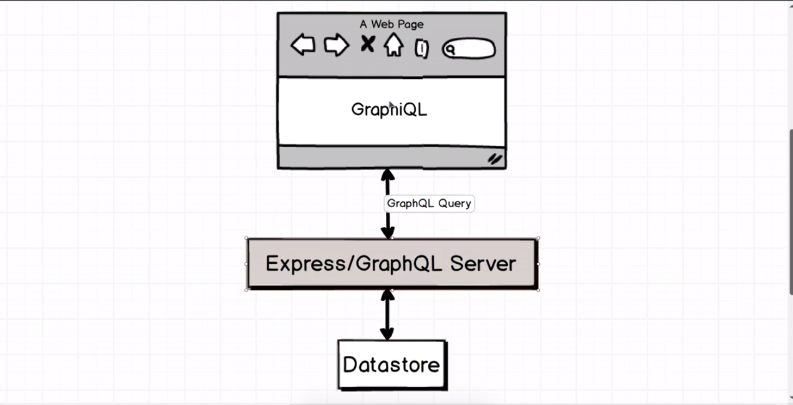
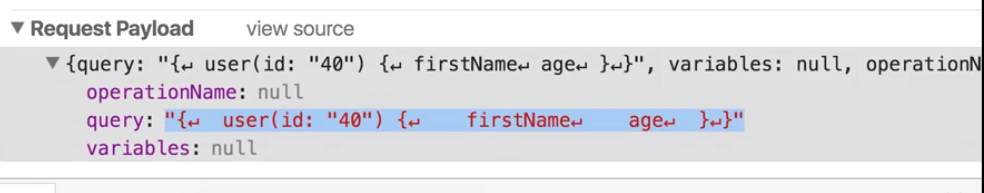
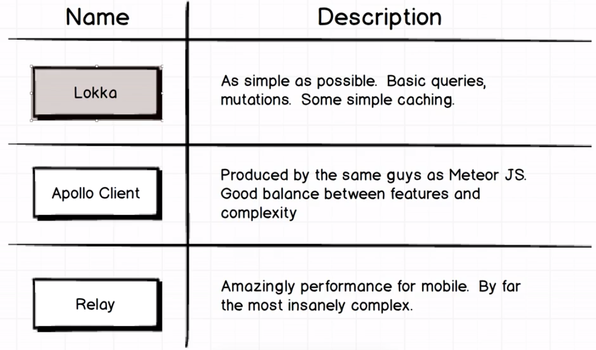
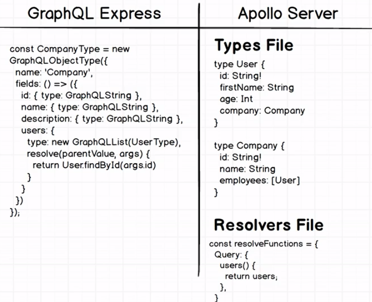
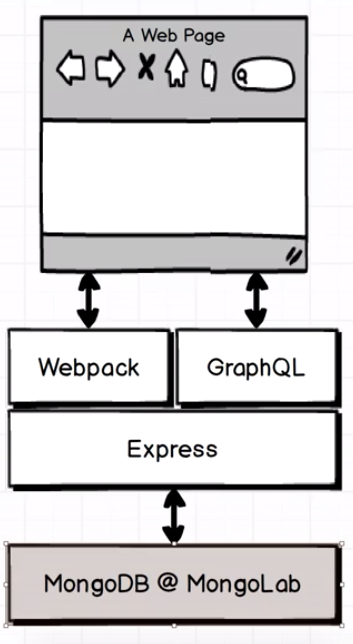
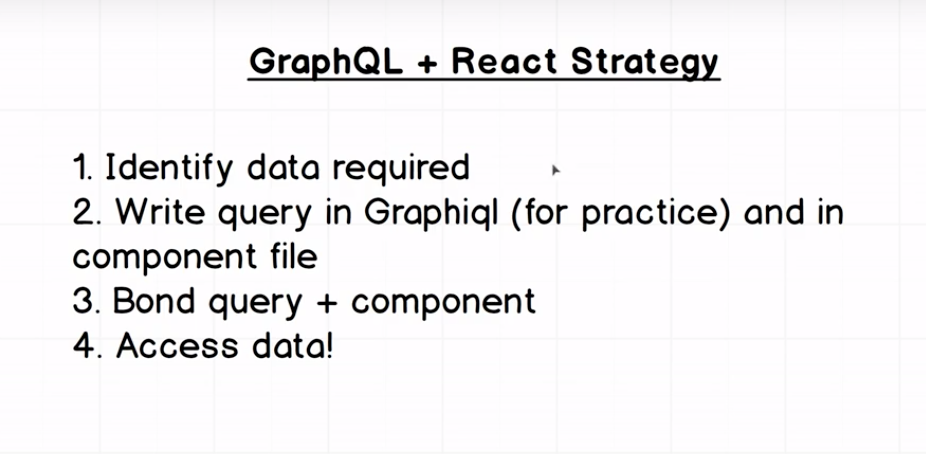
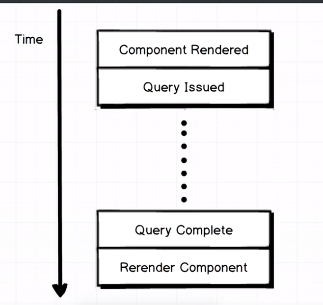
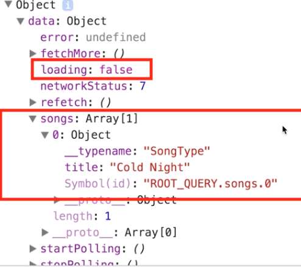

## GRAPHQL WITH REACT: THE COMPLETE DEVELOPER'S GUIDE

[GraphQL with React: The Complete Developer's Guide](https://www.udemy.com/graphql-with-react-course/)

### SECTION 1: WHY GRAPHQL?

- Why use GraphQL? What is GraphQL? How we use GraphQL 

### SECTION 2: A REST-FUL ROUTING PRIMER

#### 3. Review of REST-ful Routing
- use endpoints to get/delete/add/remove data

#### 4. Shortcomings of RESTful Routing
- when we have normalized data in the database, we would need to nest rest endponts to query data and in the end we would create a very customized endpoint that would get a customized dataset that would break rest conventions. We might also end up overserrving data


### SECTION 3: ON TO GRAPHQL

#### 5. What is GraphQL


#### 6. Working with GraphQL

`npm i --save express express-graphql graphql lodash`

```javascript
// server.js
const express = require('express');

app = express();

app.liste(4000, () => {
    console.log("hi");
})
```

#### 7. Resgistering GraphQL with Express

```javascript
// server.js
const express = require('express');
const expressGraphQL = require('express-graphql');

app = express();

app.use('/graphql', expressGraphQL({
    'graphiql': true
}))

app.liste(4000, () => {
    console.log("hi");
})

// Will give us an middleware error telling us no Schema
```

#### 8. GraphQL Schema

- we have to pass in a Schema to the expressGraphQL

```javascript
// schema.js
const graphql = require('graphql');

const { GraphQLObjectType, GraphQLString, GraphQLInt } = graphql;

const UserType = new GraphQLObjectType({
    name: 'User',
    // all the different props that a user has
    fields: {
        id: { type: GraphQLString },
        firstName: { type: GraphQLString },
        age: { type: GraphQLInt }
    }
})
```

#### 10. Root Query & 11. Resolve Data

- we need to pass in an "entry" query to GraphQL

```javascript
// schema.js
const graphql = require('graphql');
const find = require('lodash.find');

const { GraphQLObjectType, GraphQLString, GraphQLInt, GraphQLSchema } = graphql;

const users = [
    { id: "23", firstName: "Test23", age: 25},
    { id: "24", firstName: "Test24", age: 26},
    { id: "25", firstName: "Test25", age: 27},
]

const UserType = new GraphQLObjectType({
    name: 'User',
    // all the different props that a user has
    fields: {
        id: { type: GraphQLString },
        firstName: { type: GraphQLString },
        age: { type: GraphQLInt }
    }
});

const RootQuery = new GraphQLObjectType({
    name: 'RootQueryType',
    fields: {
        user: {
            type: UserType,
            args: { id: { type: GraphQLString }},
            resolve(parentValue, args) {
                // resolve function allows us to return data from the query
                // Returns th
                return find(users, { id: args.id })
            }
        }
    }
})

// need to get it to return the rootquery to a schema
// need to get it to return the rootquery to a schema
RootSchema = new GraphQLSchema({
    query: RootQuery
});

module.exports = RootSchema;
```

```javascript
// server.js
const express = require('express');
const expressGraphQL = require('express-graphql');
const schema = require('./schema')

app = express();

app.use('/graphql', expressGraphQL({
    'graphiql': true,
    schema: schema
}))

app.liste(4000, () => {
    console.log("hi");
})

// Will give us an middleware error telling us no Schema
```

#### 12. The GraphiQL Tool

The below query is a graphql query to get the id firstName and age
```javascript
{
    user(id: "23") {
        id,
        firstName,
        age
    }
}
```

#### 13. A Realistic Datasource

In a real enterprise there will be a multitude of datasources that would need to be aggregated in order to fetch data together as single json


to mockup a json api we can use this: https://github.com/typicode/json-server

#### 14. Async Resolve Function

```javascript
// schema.js
const graphql = require('graphql');
// const find = require('lodash/find');

const { GraphQLObjectType, GraphQLString, GraphQLInt, GraphQLSchema } = graphql;

// const users = [ 
//     { id: "23", firstName: "Test23", age: 25},
//     { id: "24", firstName: "Test24", age: 26},
//     { id: "25", firstName: "Test25", age: 27},
// ]

const UserType = new GraphQLObjectType({
    name: 'User',
    // all the different props that a user has
    fields: {
        id: { type: GraphQLString },
        firstName: { type: GraphQLString },
        age: { type: GraphQLInt }
    }
});

const RootQuery = new GraphQLObjectType({
    name: 'RootQueryType',
    fields: {
        user: {
            type: UserType,
            args: { id: { type: GraphQLString }},
            resolve(parentValue, args) {
                // resolve function allows us to return data from the query
                // Returns th
                // return find(users, { id: args.id })
                return axios.get(`http://localhost:3000/users/${args.id}`).then(res => res.data)
            }
        }
    }
})

// need to get it to return the rootquery to a schema
// need to get it to return the rootquery to a schema
RootSchema = new GraphQLSchema({
    query: RootQuery
});

module.exports = RootSchema;
```

#### 16. Company Definitions


### SECTION 4: FETCHING DATA WITH QUERIES

#### 17. Nested Queries

we need to associate the company type 

```javascript
// schema.js
// 
// 

//sample data definitions
//
const users = [ 
    { id: "23", firstName: "Test23", age: 25, companyId: "1"},
    { id: "24", firstName: "Test24", age: 26, companyId: "2"},
    { id: "25", firstName: "Test25", age: 27, companyId: "3"},
]
// 
const companies = [ 
    { id: "1", name: "Apple", description: "iPhone"},
    { id: "2", name: "Microsoft", description: '"Win 10'},
    { id: "3", name: "Amazon", description: "Alexa"},
]

const CompanyType = new GraphQLObjectType({
    name: 'Company',
    // all the different props that a user has
    fields: {
        id: { type: GraphQLString },
        name: { type: GraphQLString },
        description: { type: GraphQLString }
    }
});

const UserType = new GraphQLObjectType({
    name: 'User',
    // all the different props that a user has
    fields: {
        id: { type: GraphQLString },
        firstName: { type: GraphQLString },
        age: { type: GraphQLInt },
        company: {
            type: CompanyType // <---- THIS IS HOW RELATIONS WORK
        }
    }
});

```

#### 18. More on Nested Queries


Notice in the code below we don't specify the FK from user to company in `UserType` as `companyId` (instead we specify as `company`) as per our data definition. Because we will use the resolve function to specify the value of `company` to map it to `companyId`,

```javascript
// schema.js
// 
// 

//sample data definitions
//
const users = [ 
    { id: "23", firstName: "Test23", age: 25, companyId: "1"},
    { id: "24", firstName: "Test24", age: 26, companyId: "2"},
    { id: "25", firstName: "Test25", age: 27, companyId: "3"},
]
// 
const companies = [ 
    { id: "1", name: "Apple", description: "iPhone"},
    { id: "2", name: "Microsoft", description: '"Win 10'},
    { id: "3", name: "Amazon", description: "Alexa"},
]

const CompanyType = new GraphQLObjectType({
    name: 'Company',
    // all the different props that a user has
    fields: {
        id: { type: GraphQLString },
        name: { type: GraphQLString },
        description: { type: GraphQLString }
    }
});

const UserType = new GraphQLObjectType({
    name: 'User',
    // all the different props that a user has
    fields: {
        id: { type: GraphQLString },
        firstName: { type: GraphQLString },
        age: { type: GraphQLInt },
        company: {
            type: CompanyType, // <---- THIS IS HOW RELATIONS WORK
            resolve(parentValue, args) {
                axios.get(`http://localhost:3000/${parentValue.companyId}`).then(res => res.data);
                // this is how relations work. parentValue is the value "parent" type object. In ths case, company is nested in UserType so the parent is the value we fetch back from user
            }
        }
    }
});

```

We can how query like so:

```javascript
{
    user(id: "23") {
        firstName,
        company: {
           id,
           name,
           description 
        }
    }
}
```

and get back 
```javascript
{
    "data": {
        "user": {
            "firstName": "Test23",
            "company": {
                "id": "1",
                "name": "Apple",
                "description": 'iPhone'
            }
        }
    }
}
```

#### 19. A Quick Breather


The `resolve` function is what takes you from one type to another type


Think about the `resolve` function as edges and the types as nodes


#### 20. Multiple RootQuery Endpoints

We cannot direction query for a company like so:

```javascript
{
    company(id: "1") {
        name
    }
}
```

This is because we do not have the company on our root query

So, let's instantiate companies in the root query like so:

```javascript
const RootQuery = new GraphQLObjectType({
    name: 'RootQueryType',
    fields: {
        user: {
            type: UserType,
            args: { id: { type: GraphQLString }},
            resolve(parentValue, args) {
                // resolve function allows us to return data from the query
                // Returns th
                // return find(users, { id: args.id })
                return axios.get(`http://localhost:3000/users/${args.id}`).then(res => res.data)
            }
        },
        company: {
            type: CompanyType,
            args: { id: { type: GraphQLString }},
            resolve(parentValue, args) {
                return axios.get(`http://localhost:3000/companies/${args.id}`).then(res => res.data)
            } 
        }
    }
})
```

#### 21. Bidirectional Relations & 22. More On Bidirectional Relationships & 23. Resolving Circular References

 Right now we cannot query for all the employees that work for a company, but we can query for all the companies that a user works for.

So we can do like so:

```javascript
const CompanyType = new GraphQLObjectType({
    name: 'Company',
    // all the different props that a user has
    fields: {
        id: { type: GraphQLString },
        name: { type: GraphQLString },
        description: { type: GraphQLString },
        users: {
            type: GraphQLList(UserType),
            resolve(parentValue, args) {
                return axios.get(
                    `http://localhost:3000/companies/${parentValue.id}/users`
                ).then(
                    res => res.data
                )
            }
        }
    }
});

const UserType = new GraphQLObjectType({
    name: 'User',
    // all the different props that a user has
    fields: {
        id: { type: GraphQLString },
        firstName: { type: GraphQLString },
        age: { type: GraphQLInt },
        company: {
            type: CompanyType, // <---- THIS IS HOW RELATIONS WORK
            resolve(parentValue, args) {
                axios.get(`http://localhost:3000/${parentValue.companyId}`).then(res => res.data);

                // this is how relations work. parentValue is the value "parent" type object. In ths case, company is nested in UserType so the parent is the value we fetch back from user
            }
        }
    }
});
```
The above code should enable us to get a list of users that work for a company  but it gives us UserType is not defined, that's because UserType is defined farther down in the code but we are using it already, HOWEVER if we move UserType to the top, it wouldn't work out because we are using CompanyType in UserType, this is a Circular Reference Issue. We can fix this by returning the `fields` property in a function as below

```javascript
const CompanyType = new GraphQLObjectType({
    name: 'Company',
    //  fields is now a function
    fields: () => ({
        id: { type: GraphQLString },
        name: { type: GraphQLString },
        description: { type: GraphQLString },
        users: {
            type: GraphQLList(UserType),
            resolve(parentValue, args) {
                return axios.get(
                    `http://localhost:3000/companies/${parentValue.id}/users`
                ).then(
                    res => res.data
                )
            }
        }
    })
});

const UserType = new GraphQLObjectType({
    name: 'User',
    fields: () => ({
        id: { type: GraphQLString },
        firstName: { type: GraphQLString },
        age: { type: GraphQLInt },
        company: {
            type: CompanyType,
            resolve(parentValue, args) {
                return axios.get(`http://localhost:3000/${parentValue.companyId}`).then(res => res.data);
            }
        }
    })
});
```

This enables us to do circular referencing:

```javascript
{
    company(id: "1") {
        name,
        users: {
            firstName,
            age,
            company: {
                name,
                users: {
                    firstName,
                    age
                }
            }
        }
    }
}
```

Here we ae asking for the list of users that work for the company, then their age and the company that they work for (which is the first company that we asked for), and the users ... 


#### 24. Query Fragments

we can name our queries like so:

```javascript
query findCompany {
    company(id: "1") {
        name,
        description
    }
}
```

I can ask for multiple companies in 1 query:

```javascript
{
    company(id: "1") {
        name,
        description
    }
    company(id: "2") {
        name,
        description
    }
}
````

I cannot do the above because the query key `company` is duplicated. The result that I get back uses the query key (in this case `company`) as the field in the json response. Instead I have to do something like this:

```javascript
{
    apple: company(id: "1") {
        name,
        description
    }
    google: company(id: "2") {
        name,
        description
    }
}
````
Now `apple` and `google` will be used as fields for the data that I get back

We can also define query fragments like so:

```javascript
{
    apple: company(id: "1") {
        ...companyDetails
    }
    google: company(id: "2") {
        ...companyDetails
    }
}

fragment companyDetails on Company {
    name,
    description
}
````

#### 25. Introduction to Mutations & 26. NonNull Fields and Mutations

There will be a "Mutations" object like the "RootQuery" that we define to mutate the data


```javascript
const mutation = new GraphQLObjectType({
    name: 'Mutation':
    fields: {
        addUser: {
            type: UserType,
            // args will be the parameters that we pass in to add a new user . It makes sense that 
            // the new user should have an age and a first name but not necessarily a  company. So we can use GraphQLNonNull 
            args: { 
                firstName: { type: new GraphQLNonNull(GraphQLString) },
                age: { type: new GraphQLNonNull(GraphQLInt) },
                companyId: { type: GraphQLString }
            },
            // the resolve function will return the data that we expect to get back after the mutation
            // sometimes, it will not be the same as the type that we are sending in
            resolve(parentValue, args) {
                return axios.post(
                    `http://localhost:3000/users`, { firstName, age }
                ).then(
                    res => res.data
                ) 
            }
        }
    }
})
```

To use this definition we can:

```javascript
mutation {
    addUser(firstName: "Test26", age: 29) {
        id,
        firstName,
        age
    }
}
```
#### 27. Do it Yourself, Delete Mutations

```javascript
const mutation = new GraphQLObjectType({
    name: 'Mutation':
    fields: {
        addUser: {
            type: UserType, //  type is the type that you expect to be returned
            // args will be the parameters that we pass in to add a new user . It makes sense that 
            // the new user should have an age and a first name but not necessarily a  company. So we can use GraphQLNonNull 
            args: { 
                firstName: { type: new GraphQLNonNull(GraphQLString) },
                age: { type: new GraphQLNonNull(GraphQLInt) },
                companyId: { type: GraphQLString }
            },
            // the resolve function will return the data that we expect to get back after the mutation
            // sometimes, it will not be the same as the type that we are sending in
            resolve(parentValue, args) {
                return axios.post(
                    `http://localhost:3000/users`, { firstName, age }
                ).then(
                    res => res.data
                ) 
            }
        },
        deleteUser: {
            type: UserType, //  type is the type that you expect to be returned
            args: {
                userId: { type: new GraphQLNonNull(GraphQLString) }
            },
            resolve(parentValue, args) {
                return axios.delete(
                    `http://localhost:3000/users/${args.id}`
                ).then(
                    res => res.data
                )
            }
        }
    }
})
```
we can call it like so:

```javascript
mutation {
    deleteUser(id: "23") {
        id
    }
}
```

But in the current implementation of the json server, we do not return anything when we perform a delete 


#### 28. Do it yourself - Edit Mutations

Note Put vs Patch difference: a Put replaces the entirety of a existing record. A Patch only replaces specific fields of a given record as specified in the body


```javascript
const mutation = new GraphQLObjectType({
    name: 'Mutation':
    fields: {
        addUser: {
            type: UserType, //  type is the type that you expect to be returned
            // args will be the parameters that we pass in to add a new user . It makes sense that 
            // the new user should have an age and a first name but not necessarily a  company. So we can use GraphQLNonNull 
            args: { 
                firstName: { type: new GraphQLNonNull(GraphQLString) },
                age: { type: new GraphQLNonNull(GraphQLInt) },
                companyId: { type: GraphQLString }
            },
            // the resolve function will return the data that we expect to get back after the mutation
            // sometimes, it will not be the same as the type that we are sending in
            resolve(parentValue, args) {
                return axios.post(
                    `http://localhost:3000/users`, { firstName, age }
                ).then(
                    res => res.data
                ) 
            }
        },
        deleteUser: {
            type: UserType, //  type is the type that you expect to be returned
            args: {
                id: { type: new GraphQLNonNull(GraphQLString) }
            },
            resolve(parentValue, args) {
                return axios.delete(
                    `http://localhost:3000/users/${args.id}`
                ).then(
                    res => res.data
                )
            }
        }
    },

    editUser: {
        type: UserType,
        args: {
            id: { type: new GraphQLNonNull(GraphQLString) },
            firstName: { type: GraphQLString },
            age: { type: GraphQLInt },
            companyId: { type: GraphQLString }
        },
        resolve(parentValue, args) {
            return axios.patch(
                `http://localhost:3000/users/${args.id}`, args 
                //note that in the args body there is already an id field
                // so if we pass in an id in the url and an id in the args would it possibly conflict?
                // No, because json-server ignores duplicate ids
            ).then(
                res => res.data
            )
        }
    }
})
```

```javascript
mutation {
    editUser(id: "40", age: 10) {
        id,
        firstName,
        age
        // thiis get resolved 
    }
}
```


#### 29. Relay vs Apollo



What does the request payload look like in GraphQL 

```javascript
{
    user(id: 49) {
        firstName
    }
}
````

It's a POST request:



It's just a string that we pass in. It takes `{ operationName, query: variables: }`



Lakka - very easy to use, Apollo - very easy to use, opinionated, Relay - very hard, but very versatile


#### 30. Apollo Server vs GraphQL Server 



Apollo will change very fast vs standard GraphQL 

Apollo moves resolver and types in 2 seperate files while GraphQL has the resolver and type in 1 object


### SECTION 6: CLIENTSIDE GRAPHQL

#### 31. The Next App

`https://github.com/StephenGrider/Lyrical-GraphQL`


#### 32. Starter Pack Walkthrough

This will be a crowdsource song writing website where user can click on a song and add single lines of lyrics to it




#### 34. Mongolab Setup

#### 35. Walking Through the Schema

Docs tab automatically generate docs for the GraphQL schemas that are available to you on your project

Let's create a mutation to add a song

```javascript
mutation {
    addSong(title: "Cold Night"): {
        id
    }
}
```

I get back something like

```json
{ 
    "data": {
        "addSong": {
            "id": "547657acchgfyt865"
        }
    }
}
```
Let's add some lyrics ..

```javascript
mutation {
    addLyric(id: "547657acchgfyt865", content: "it's a cold night"): {
        id // <-- this is the ID of the song we modofied, not the lyric that was created
    }
}
```

I get back something like

```json
{ 
    "data": {
        "addLyric": {
            "id": "547657acchgfyt865"
        }
    }
}
```

If I query for the whole song I get something like:

```javascript
{
    song(id: "547657acchgfyt865"): {
        id,
        title,
        lyrics
    }
}
```

```json
{ 
    "data": {
        "song": {
            "id": "547657acchgfyt865",
            "title": "its a cold night",
            "lyrics": [
                { "content": "it's a cold night"}
            ]
        }
    }
}
```

#### 36. Apollo Client Setup


In between the graphql server and react app is the Apollo Store is what is going to communicate with the GraphQL Server and saves data that comes back from GraphQL. The Apollo Provider is the integration layer between the Apollo Store and react app.


client/index.js

```javascript
import React from 'react';
import ReactDOM from 'react-dom';
import ApolloClient from 'apollo-client';
import { ApolloProvider } from 'react-apollo';

const client = new ApolloClient({}); // this is frontend library agnostic, irt doesn't care if you are using Vue, React, or Angular

const Root = () => {
  return (
    // ApolloProvider moves data from apollo store to the react code
    <ApolloProvider client={client}>
        <div>Lyrical</div>
    </ApolloProvider>
  );
};

ReactDOM.render(
  <Root />,
  document.querySelector('#root')
);
````

#### 37. React Component Design


We have the SongList, SongDetail, and LyricList, and LyricCreate

Let's start with `SongList.js`

client/components/SongList.js
```javascript
import React, { Component } from 'react';

class SongList extends Component {

  render() {
    return (
      <div>
        SongList
      </div>
    );
  }
}

export default SongList;

````

#### 38. GQL Queries in React & 39. Bonding Queries with Components & 40. Handling Pending Queries & 41. Fixing Key Warnings



Using this for the SongList.js

_GraphQL + React Strategy_

1. Identify the Data Required -- we are gonna need the title of the song
2. Write the Query in Graphiql
```javascript
    { 
        song {
            title
        }
    }
````
3. Bond the query and the client -- GraphQL is not valid JS code, so we need `graphql-tag`

client/components/SongList.js
```javascript
import React, { Component } from 'react';
import gql from 'graphql-tag';
import { graphql } from 'react-apollo';

class SongList extends Component {

  renderSongs() {
    // keep in mind that data is undefined at first because data has not been fetched by graphql upon initial render
    return this.props.data.songs.map(({ id, title }) => {
      return (
        <li key={id}>
            {title}
        </li>
      );
    });
  }

  render() {
    // we can see the results in
    console.log(this.props);

    // Notice the "loading" attribute .. we can use that to determine whether or not gql is finished
    if(this.props.data.loading) { return <div>Loading ...</div>}
    
    return (
      <div>
        {this.renderSongs()}
      </div>
    );
  }
}

//defines the query
const query = gql`
    { 
        song {
            title
        }

    }
`;

// we now need to bind the companent in graphql

export default graphql(query)(SongList);

````



When the component is rendered it will execute the query and then the query will take sometime to execute before the component is rerendered with the data received. So the component gets rendered twice. The resuts of the query is saved to the `props`

The props look like this with the data inside `props.data.[graphql object name in this case songs]`



Notice the "loading" attribute .. we can use that to determine whether or not gql is finished


#### 42. Architecture Review

Note that we typically try to centralize the query to a root component, which is SongList in this case and then pass the props down (BUT wouldn't you need to cause unecessary rerender??)

