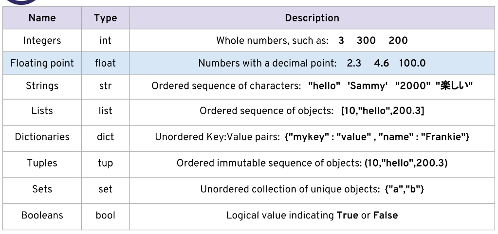
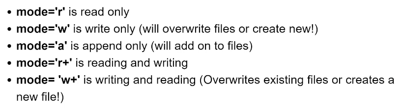

## 1. PYTHON OBJECT AND DATA STRUCTURE BASICS

### 10. Introduction to Python Data Types



### 11. Python Numbers

[Numbers Notebook](http://localhost:8888/lab/tree/notebooks/00-Python%20Object%20and%20Data%20Structure%20Basics/01-Numbers.ipynb)

### 13. Variable Assignments

[Variable Assignment](http://localhost:8888/lab/tree/notebooks/00-Python%20Object%20and%20Data%20Structure%20Basics/01-Variable%20Assignment.ipynb)

### 14. Introduction to Strings

[Strings](http://localhost:8888/lab/tree/notebooks/00-Python%20Object%20and%20Data%20Structure%20Basics/02-Strings.ipynb)

- things to note: Strings are immutable, can't assign them like lists like so: <code>s[9] = "a"</code>

- the split function gets all the strings up until the next char to split on

### 18. Print Formatting with Strings

[Print Formatting](http://localhost:8888/lab/tree/notebooks/00-Python%20Object%20and%20Data%20Structure%20Basics/03-Print%20Formatting%20with%20Strings.ipynb)

- Float formatting follows `"result: {value:{width}.{precision}}"` 
- f-strings -- New in Python36 allows you to pass in the variable into the string via prefixing an `f` in front of the string like `f"this is a f-string: {test}"`
- We can also apply formatting using alignment and precision


### 20. Lists in Python

[Lists](http://localhost:8888/lab/tree/notebooks/00-Python%20Object%20and%20Data%20Structure%20Basics/04-Lists.ipynb)


### 22. Dictionaries in Python

[Dictionaries](http://localhost:8888/lab/tree/udemy-course-notes/python_bootcamp/notebooks/00-Python%20Object%20and%20Data%20Structure%20Basics/05-Dictionaries.ipynb)

### 24. Tuples with Python

[Tuples](http://localhost:8888/lab/tree/udemy-course-notes/python_bootcamp/notebooks/00-Python%20Object%20and%20Data%20Structure%20Basics/06-Tuples.ipynb)

- Note that tuples are immutable like strings

- some usefule built in method for tuples: `.count` counts the number of occurrances in a tuple, `.index` gets first index where elements are listed

### 25. Sets in Python

[Sets](http://localhost:8888/lab/tree/udemy-course-notes/python_bootcamp/notebooks/00-Python%20Object%20and%20Data%20Structure%20Basics/07-Sets%20and%20Booleans.ipynb)

### 26. Booleans in Python

[Booleans](http://localhost:8888/lab/tree/udemy-course-notes/python_bootcamp/notebooks/00-Python%20Object%20and%20Data%20Structure%20Basics/07-Sets%20and%20Booleans.ipynb)

### I/O with Basic Files in Python

[Files](http://localhost:8888/lab/tree/udemy-course-notes/python_bootcamp/notebooks/00-Python%20Object%20and%20Data%20Structure%20Basics/08-Files.ipynb)

-  I can write text files like so in a notebook

```python
%%writefile test.txt
Hello, this is a quick test file.
```
- ```pwd``` command gets to the current dir of the notebook

- Note that I cannot run `file.read()` twice, I need to reset the cursor like so `file.seek(0)`

- we can set a file with a with block like so:

```python
with open('myfile.txt') as f:
    contents = f.read()
    
print(contents)
```

this asigns open(...) to f and uses f within the indented block




## SECTION 4: PYTHON COMPARISON OPERATORS

### 31. Comparison Operators in Python

[Comparison Operators](http://localhost:8888/lab/tree/udemy-course-notes/python_bootcamp/notebooks/01-Python%20Comparison%20Operators/01-Comparison%20Operators.ipynb)

- Note that in str equalties, capitals count 

### 32. Chaining Comparison Operators in Python with Logical Operators

[Chaining Operators](http://localhost:8888/lab/tree/udemy-course-notes/python_bootcamp/notebooks/01-Python%20Comparison%20Operators/02-Chained%20Comparison%20Operators.ipynb)

- chained comparisons are evaulated from left to right, we can do `1 < 2 < 3` will evaulate to true and `1 < 2 > 3` is false

### 33. If Elif and Else Statements in Python

[If Elif Statements](http://localhost:8888/lab/tree/udemy-course-notes/python_bootcamp/notebooks/02-Python%20Statements/02-if,%20elif,%20and%20else%20Statements.ipynb)

### 34. For Loops in Python

[For Loops](http://localhost:8888/lab/tree/udemy-course-notes/python_bootcamp/notebooks/02-Python%20Statements/03-for%20Loops.ipynb)

We can do tuple unpacking like so:

```python
list2 = [(1,2), (3,4), (5,6)]
for (t1,t2) in list2:
    print(t1)
```

*Note that .items() on a dict returns to us a tuple*

### 35. While Loops in Python

[While Loops](http://localhost:8888/lab/tree/udemy-course-notes/python_bootcamp/notebooks/02-Python%20Statements/04-while%20Loops.ipynb)

we can have while ... else statement:

```python
x = 0

while x < 10:
    print('x is currently: ',x)
    print(' x is still less than 10, adding 1 to x')
    x+=1
    
else:
    print('All Done!')
```

- break: Breaks out of the current closest enclosing loop.
- continue: Goes to the top of the closest enclosing loop.
- pass: Does nothing at all.

### 36. Useful Operators in Python

[Useful Operators](http://localhost:8888/lab/tree/udemy-course-notes/python_bootcamp/notebooks/02-Python%20Statements/05-Useful-Operators.ipynb)

We can use the `enumerate` function to generate a tuple of a list of items
```python
list(enumerate('abcde'))
```
yields
```python
[(0, 'a'), (1, 'b'), (2, 'c'), (3, 'd'), (4, 'e')]
```
We can use teh `zip` function to do the opposite

### 37. List Comprehensions in Python

[List Comprehension](http://localhost:8888/lab/tree/udemy-course-notes/python_bootcamp/notebooks/02-Python%20Statements/06-List%20Comprehensions.ipynb)


# UNDERSTANDING PYTHON UNDER THE HOOD

## From the SmartAI Medium

[Part I](https://medium.com/@SmartLabAI/python-under-the-hood-tips-and-tricks-from-a-c-programmers-perspective-01-b5f96895663)

- The most popular version of Python is CPython, but others include IronPython, Jython, Cython
- Python code is compiled in bytecode that is run by Python VM like Java 
- Everything in Python is an object, that is why Numpy is not implemented in Python, it just have an interface to it. Therefore, nothing in Python is typed

```python
integer = 5
floating_point = 5.0
string = "Five"
l = list()
d = dict()
print("integer is an object: ", isinstance(integer, object)) # True
print("floating_point is an object: ", isinstance(floating_point, object)) # True
print("string is an object: ", isinstance(string, object)) # True
print("l is an object: ", isinstance(l, object)) # True
print("d is an object: ", isinstance(d, object)) # True
```

- Defined ints are also objects in Python
```python
x = 5
y = x
print("ID of x: ", id(x))
print("ID of y: ", id(y)) # id(x) = id(y)
###
a = 5
b = 5
print("ID of a: ", id(a))
print("ID of b: ", id(b)) # id(a) = id(b), because an int is immutable, see further explanation below
```
- Python garbage collects via reference counting, when a reference (variable) is out of scope, it decrements the counter by 1, when the counter hits 0 the object is deallocated from the heap
- There are data types that are immutable in Python like ints and floats. If you mutate the reference (variable), it will create a new object.
- There are mutable objects like lists and dicts that will maintain the same reference.

___Keep in mind: Although Python support default arguments, you should use them very carefully for mutable types, because they retain their values between function calls, just see the example below!___

```python
def mutable_default_arg(x=[]):
    x.append(5)
    print(x)
mutable_default_arg() # [5]
mutable_default_arg()# [5, 5]
mutable_default_arg() # [5, 5, 5]
```

[Part II](https://medium.com/@SmartLabAI/python-under-the-hood-tips-and-tricks-from-a-c-programmers-perspective-02-b52675c7c0af)

- In Python, everything is public according to the C++-paradigm. Being everything accessible means, that you do not need getters/setters.
- in Python, you write self instead of this to refer for the actual instance of the class — and the constructor is called __init__. It is to be emphasized that self is just a convention, you can call it “kitten” if you’d like, but important is: the first argument of every class method refers to the actual object instance — the name does not really matter, but remember, it keeps your code more readable for others and for you.
